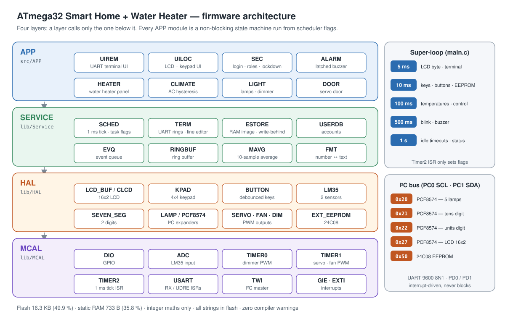

# Firmware — ATmega32 Smart Home + Electric Water Heater

PlatformIO project of the graduation project. Project overview, features and test evidence: [`../../README.md`](../../README.md).
Author: Abdelrahman Sherif Medhat · Course drivers (MCAL/HAL base set): Eng. Eslam Hefny, AMIT Learning.



## Build

```
pio run -e app
```

Output: `.pio/build/app/firmware.hex` — flash 16 344 bytes (49.9 %), static RAM 733 bytes (35.8 %). All six environments build with `-Wall` and zero warnings.

| Environment | Builds | Purpose |
|---|---|---|
| `app` | `src/APP/main.c` + all modules | the application |
| `test_base` | `test_mains/test_base.c` | smoke test of the original course drivers |
| `test_mcal` | `test_mains/test_mcal.c` | MCAL layer test |
| `test_hal` | `test_mains/test_hal.c` | HAL layer test |
| `test_service` | `test_mains/test_service.c` | SERVICE layer test |
| `test_app` | `test_mains/test_app.c` | APP layer test (automatic checks, then the full super-loop) |

Every test prints one `[PASS]` / `[FAIL]` line per check on the UART and ends with a summary. Each test file's header lists the Proteus parts and wiring it needs; the matching schematics are in [`../../simulation/layer_tests/`](../../simulation/layer_tests/).

## Run in Proteus

1. Open [`../../simulation/final/smart_home_water_heater_final.pdsprj`](../../simulation/final/smart_home_water_heater_final.pdsprj).
2. ATmega32: Program File = `.pio/build/app/firmware.hex`, Clock Frequency = **16 MHz** (must equal `F_CPU` in `platformio.ini`).
3. Virtual Terminal on PD0 / PD1: 9600 baud, 8N1, "Echo Typed Characters" off.
4. First boot on a blank EEPROM creates the admin account **`admin` / `1234`** (terminal only; change it with command 15).

Keypad (calculator pad): digits for ID and PIN, `=` Enter, `*` or `C` back, `+` / `-` step a value (dimmer ±10 %, heater ±5 °C). Keypad IDs and PINs are numeric.

## Source layout

```
src/APP/            main.c (boot order + super-loop) and the 8 APP modules
  SEC  ALARM  LIGHT  DOOR  CLIMATE  HEATER  UILOC  UIREM
lib/Service/        SCHED  TERM  ESTORE  USERDB  EVQ  RINGBUF  MAVG  FMT  + std_types.h, Bit_math.h, flash_str.h
lib/HAL/            CLCD  LCD_BUF  KPAD  BUTTON  LM35  SEVEN_SEG  LAMP  PCF8574  RELAY  LED  BUZZER  DIMMER  SERVO  FAN  EXT_EEPROM
lib/MCAL/           DIO  GIE  ADC  TIMER0  TIMER1  TIMER2  USART  TWI  EXTI  + reg_def.h
test_mains/         one test program per layer
```

Every module is `MOD.c` / `MOD.h` / `MOD_cfg.h`; pins and constants live only in the `_cfg.h` files. `lib/HAL/SSG` and `lib/MCAL/SPI` are course drivers that are present but not used (the display uses `SEVEN_SEG`; no SPI device is fitted).

## Documents (`docs/`)

| File | Content |
|---|---|
| [`specification.md`](docs/specification.md) | requirements with IDs, coding conventions, fixes made to the course drivers, Proteus notes, design decisions |
| [`architecture.md`](docs/architecture.md) | layers, every module's API, scheduler and super-loop, boot order, state machines, data ownership, RAM/flash budget, decision log |
| [`pin_map.md`](docs/pin_map.md) | final pin table and Proteus wiring |
| [`eeprom_map.md`](docs/eeprom_map.md) | byte layout of the 24C08 and the write-behind scheme |
| [`uart_protocol.md`](docs/uart_protocol.md) | every prompt, command and message, with an example session |
| [`test_plan.md`](docs/test_plan.md) | 78 Proteus steps and the [requirement coverage table](docs/test_plan.md#4-coverage) |
| [`hal_summary.md`](docs/hal_summary.md) | HAL as built, Proteus findings, the 7-segment redesign |
| [`test_app_partA_sequence.pdf`](docs/test_app_partA_sequence.pdf), [`test_app_partB_sequence.pdf`](docs/test_app_partB_sequence.pdf) | recorded Proteus results of the APP layer test (48 + 82 steps, all passed) |

Not built in v1 (specification decision 15): AC fan speed ramp, PIR alarm, LDR. Their pins stay reserved.
